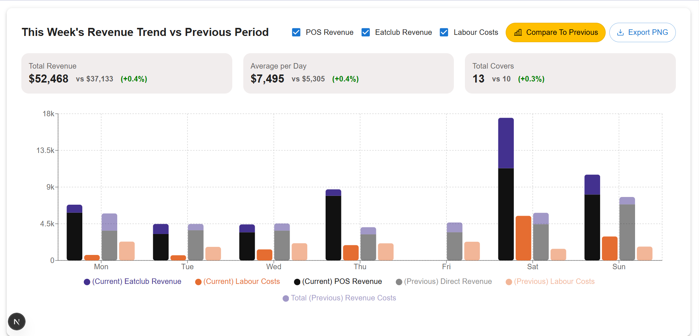
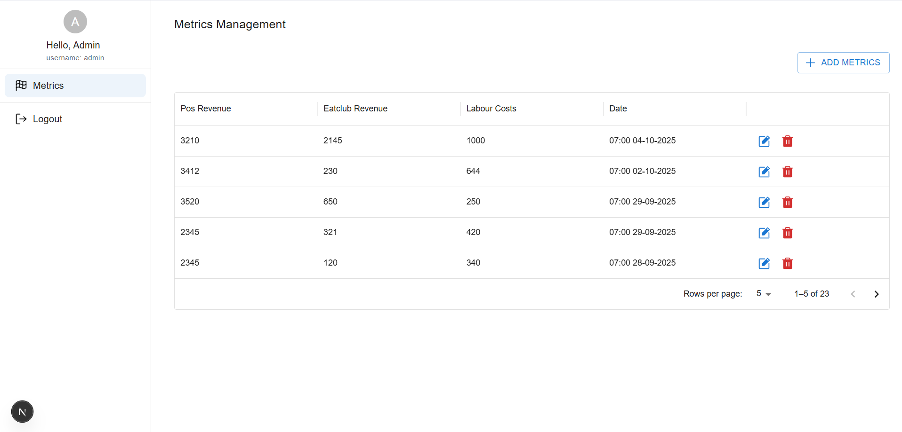

# CHART CHALLENGE

## Feature
- Login, register
- CRUD metrics
- View chart

## Backend: backend
1. ### How to run?: See that in README.md file of backend folder
2. ### Techstack:
- Expressjs, jwt, mongodb, mongoose, typdi

# Frontend: frontend
1. ### How to run?: See that in README.md file of frontend folder
2. ### Techstack:
- Nextjs, MUI, Redux toolkit, recharts, axios, Phosphor icon

